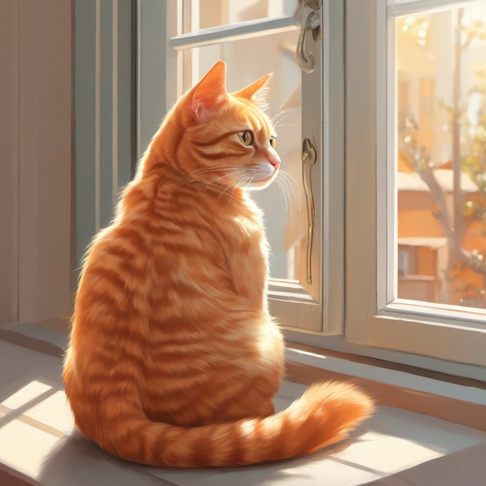

# claude-comfyui-local

**Make Claude generate images on your own local GPU** — a ComfyUI + SDXL integration guide (free, offline, no API cost).

Say "draw me a cat" and Claude refines the prompt into English, auto-starts the local ComfyUI server, and shows the finished picture right in the chat. Costs nothing, works without internet.

> Full write-up (Korean): [Making Claude draw on my laptop](https://junstellar.github.io/p/claude-local-image-generation/)

## How It Works

```
User: "Draw the Seoul skyline at sunset"
   ↓
Claude: converts/enriches the request into an English prompt
   ↓
ComfyUI server (local, http://127.0.0.1:8188) ← auto-started if down
   ↓
SDXL generates the image on the GPU (20–40s on an RTX 4060)
   ↓
Claude displays the finished PNG in chat
```

## Requirements

| Item | Requirement | Notes |
|---|---|---|
| GPU VRAM | 8GB+ recommended | For SDXL; with ≤6GB use SD 1.5 instead |
| RAM | 16GB | |
| Disk | ~20GB | ComfyUI + PyTorch + SDXL model |
| Software | Python 3.10–3.12, git | Verified on Windows 11 |

## Installation (Windows)

```powershell
# 1. Clone ComfyUI + create a virtual environment
git clone --depth 1 https://github.com/comfyanonymous/ComfyUI C:\ComfyUI
python -m venv C:\ComfyUI\venv

# 2. PyTorch (CUDA) — you MUST specify the CUDA index (plain pip gives the CPU build!)
C:\ComfyUI\venv\Scripts\python.exe -m pip install torch torchvision torchaudio --index-url https://download.pytorch.org/whl/cu128

# 3. Dependencies + SDXL model (~6.5GB)
C:\ComfyUI\venv\Scripts\python.exe -m pip install -r C:\ComfyUI\requirements.txt
curl.exe -L -o C:\ComfyUI\models\checkpoints\sd_xl_base_1.0.safetensors https://huggingface.co/stabilityai/stable-diffusion-xl-base-1.0/resolve/main/sd_xl_base_1.0.safetensors

# 4. Verify GPU detection (must print True)
C:\ComfyUI\venv\Scripts\python.exe -c "import torch; print(torch.cuda.is_available())"
```

## Files in This Repo

| File | Role |
|---|---|
| [`generate.py`](generate.py) | ComfyUI API client script: auto-starts the server → submits the workflow → saves the PNG. Copy into `C:\ComfyUI\` |
| [`skill/SKILL.md`](skill/SKILL.md) | Claude Code skill definition. Copy to `~/.claude/skills/draw-local/SKILL.md` and any "draw ..." request triggers it automatically |

```powershell
# Deploy
Copy-Item generate.py C:\ComfyUI\generate.py
New-Item -ItemType Directory -Force $HOME\.claude\skills\draw-local
Copy-Item skill\SKILL.md $HOME\.claude\skills\draw-local\SKILL.md
```

## Usage

Inside Claude Code, just say **"draw ~"**. You can also run it directly:

```powershell
C:\ComfyUI\venv\Scripts\python.exe C:\ComfyUI\generate.py "a cute orange cat sitting on a windowsill, warm sunlight, photorealistic"
# → SAVED C:\ComfyUI\output\claude_00001_.png  (seed 640348078, 24s)
```

Options: `--out PATH` `--width/--height` (default 1024) `--steps` (default 28) `--cfg` (default 7.0) `--seed` (reproduce/vary) `--negative "things to avoid"`

## Sample Results (generated on an RTX 4060 Laptop)

| Prompt | Result |
|---|---|
| `a cute orange cat sitting on a windowsill, warm sunlight, photorealistic` |  |
| `a serene mountain lake at sunrise, mist over the water, photorealistic` |  |
| `Seoul city skyline at sunset, Namsan Tower and Han River, glowing orange and purple sky, cinematic lighting` |  |

**Prompt tips**: ① write in English ② append style keywords like `photorealistic`, `cinematic lighting` ③ push unwanted elements into the negative prompt.

## Measured Performance (RTX 4060 Laptop 8GB)

- First generation: ~1 minute (server start + loading the model into VRAM)
- After that: **20–40 seconds per image** (1024×1024, 28 steps)
- On OOM (out of memory): close other GPU-heavy apps (games etc.) and retry

## License

MIT
